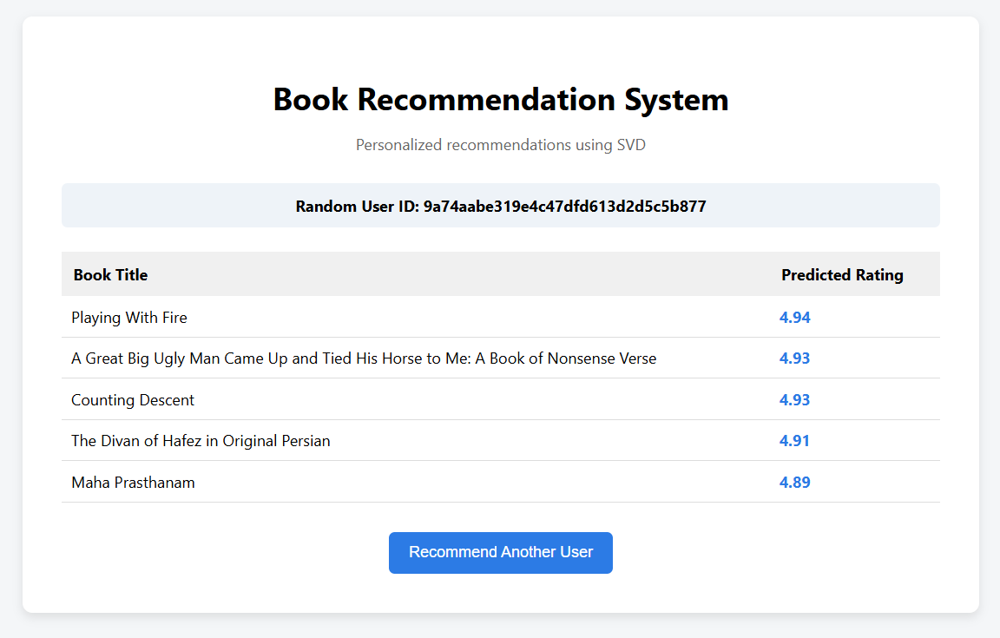

# Book Recommendation System
## Web Application Preview


## Project Overview

This project implements a **Book Recommendation System** using multiple machine learning models.
The goal is to predict book popularity and generate personalized recommendations based on historical
user–book interaction data.

Different classification and ensemble learning models are evaluated and compared.
The final recommendation system is built using **SVD (Singular Value Decomposition)**, which achieved
the best overall performance.

---

## Dataset

The dataset used in this project is the **Goodreads Interactions Dataset**, obtained from Kaggle:

https://www.kaggle.com/datasets/arashnic/goodreads-interactions-dataset

The dataset contains user–book interactions including explicit ratings.
All datasets are cleaned and preprocessed before modeling.

---

## Project Structure

book-recommendation-system/
│
├── app/ # Flask web application
├── assets/ # Saved plots
├── data/
│ ├── raw/ # Raw Kaggle datasets
│ └── processed/ # Cleaned and processed datasets
├── results/ # Trained models (.pkl files)
├── src/
│ ├── preprocessing/ # Data cleaning scripts
│ ├── models/ # ML models and evaluations
│ └── recommender/ # SVD recommendation logic
├── venv/ # Virtual environment (general ML models)
├── venv_svd/ # Virtual environment (Surprise + NumPy < 2)
├── README.md
├── requirements.txt
└── requirements_svd.txt


---

## Data Preprocessing

Data preprocessing is performed in the `src/preprocessing/` directory.
The following steps are applied:

- Removing missing and invalid values
- Filtering relevant columns
- Merging book metadata with interaction data
- Creating a binary popularity label:
  - `rating > 3` → Popular (1)
  - `rating ≤ 3` → Not Popular (0)

The final cleaned dataset is saved under: data/processed/cleaned.csv


---

## Machine Learning Models

The following models were implemented and evaluated:

- Logistic Regression
- Random Forest
- AdaBoost (Boosting)
- Bagging (MLP as base learner)
- Multi-Layer Perceptron (MLP)
- Stacking Ensemble
- SVD (Collaborative Filtering)

Class imbalance was handled using **SMOTE** where applicable.

---
## Model Comparison

The following table summarizes the performance of all implemented models.
Classification models are evaluated using **Accuracy** and **ROC-AUC**, while
the recommendation model (SVD) is evaluated using **RMSE** and **MAE**.

| Model                        | Accuracy | ROC-AUC | RMSE  | MAE  |
|------------------------------|----------|---------|-------|------|
| Logistic Regression          | 0.7548   | 0.5310  |   –   |  –   |
| Random Forest                | 0.6172   | 0.6376  |   –   |  –   |
| AdaBoost (Boosting)          | 0.7560   | 0.6496  |   –   |  –   |
| Multi-Layer Perceptron (MLP) | 0.7506   | 0.6537  |   –   |  –   |
| Stacking Ensemble            | 0.7341   | 0.6493  |   –   |  –   |
| **SVD**                      |   –      | 0.7262* | 0.8657| 0.6842 |

\* ROC-AUC for SVD is computed by converting ratings into a binary popularity label (rating > 3).

**Note:**  
Accuracy and ROC-AUC are reported only for classification models.
SVD is a collaborative filtering recommendation model and is therefore evaluated
primarily using regression-based metrics (RMSE and MAE).

---

## Evaluation Metrics
- **Classification Models**
  - Accuracy
  - ROC Curve
  - ROC-AUC Score

- **Recommendation Model (SVD)**
  - RMSE (Root Mean Squared Error)
  - MAE (Mean Absolute Error)

ROC curves for all classification models are saved in the `assets/` directory.

---

## Recommendation System (SVD)

The final recommendation system is built using **SVD (Singular Value Decomposition)** from the
`surprise` library.

Reasons for choosing SVD:
- Best RMSE and MAE performance
- Strong collaborative filtering capability
- Scalable to large datasets

The trained model is saved as: results/svd_model.pkl


---

## Running the Project
### 1. Clone the Repository
```bash
git clone https://github.com/azraj/book-recommendation-system.git
cd book-recommendation-system
```
### 2. Create Environment for Preprocessing and ML Models
This environment is used for:
- Data preprocessing
- Classification models
- Ensemble models
```bash
python -m venv venv
venv\Scripts\activate        # Windows
# source venv/bin/activate  # Linux / Mac

pip install -r requirements.txt
```

### 3. Data Preprocessing
Clean and prepare the dataset.
```bash
python src/preprocessing/preprocess.py
```
Output file: data/processed/cleaned.csv

### 4. Train and Evaluate Classification Models
Run each model separately to generate evaluation metrics and plots.
```bash
python src/models/logistic_regression.py
python src/models/random_forest.py
python src/models/boosting.py
python src/models/mlp.py
python src/models/ensemble.py
```

### 5. Create Environment for Recommendation System (SVD)
(The Surprise library requires NumPy < 2, so a separate environment is needed.)
```bash
python -m venv venv_svd
venv_svd\Scripts\activate

pip install -r requirements_svd.txt
```

### 6. Train the SVD Recommendation Model
```bash
python src/models/train_svd.py
```
Output: results/svd_model.pkl

### 7. Run the Web Application
```bash
python app/app.py
```
Then open your browser and go to: http://127.0.0.1:5000

## Important Notes
- Execution order must be followed exactly.
- Two separate environments are required due to NumPy compatibility.
- All experiments presented in the report and presentation correspond exactly to the code in this repository.

## Project Presentation
📄 [Final Presentation (PDF)](presentation.pdf)
